### Pasos para ejecutar en local

- Clonar este repositorio.
- Tener instalado Node.js
- Instalar dependencias `yarn` _si usas otro gestor no hay problema_.
- Iniciar el proyecto con _dev_ `yarn dev`

### Plataforma de películas con las siguientes características:

- Landing page.
- Inicio de sesión.
- Validación de campos.
- Visualización de categorías.
- Visualización del contenido de las categorías.
- Visualización del contenido multimedia y su respectiva información.
- Página 404 para contenido no encontrado.
- Diseño responsive.
- Tema claro y oscuro.

### Landing page

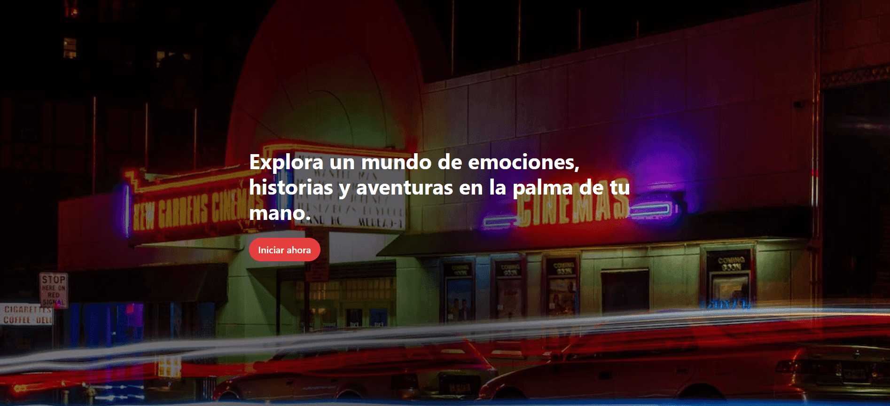
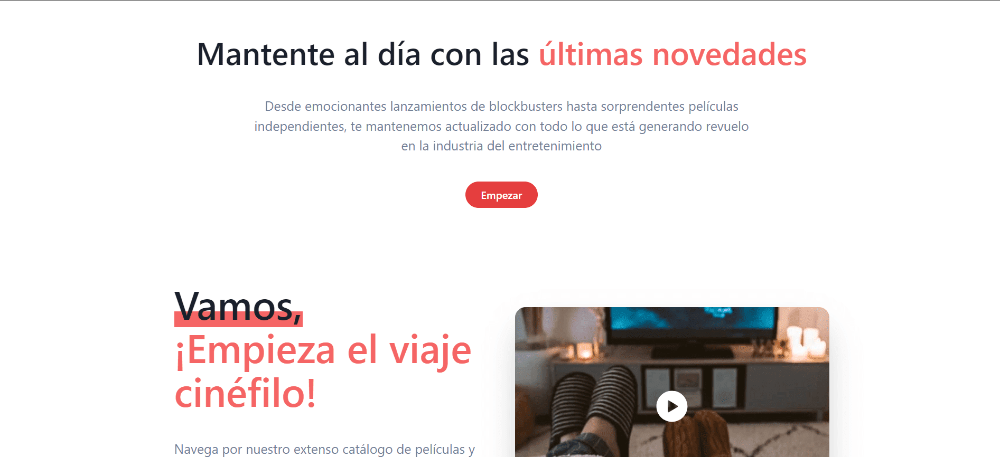

### Inicio de sesión

_Usuario de prueba:_ 
_correo:_ **csirl4@dailymail.co.uk** 
_contraseña:_ **nG9Auta45BCm$** 

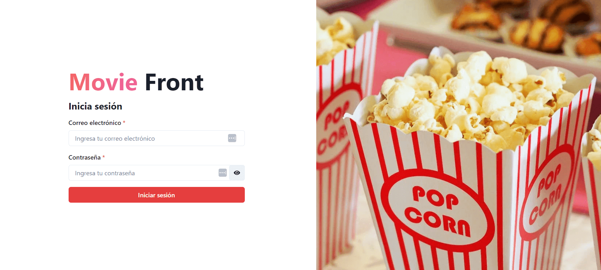

### Valicación de campos

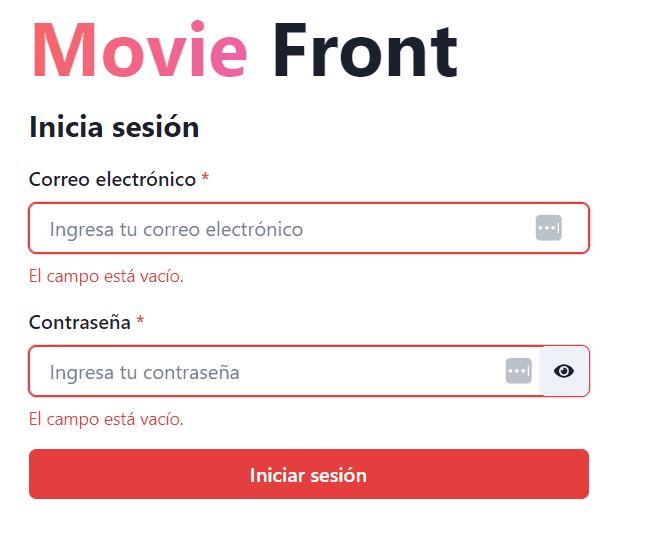

### Visualización de categorías

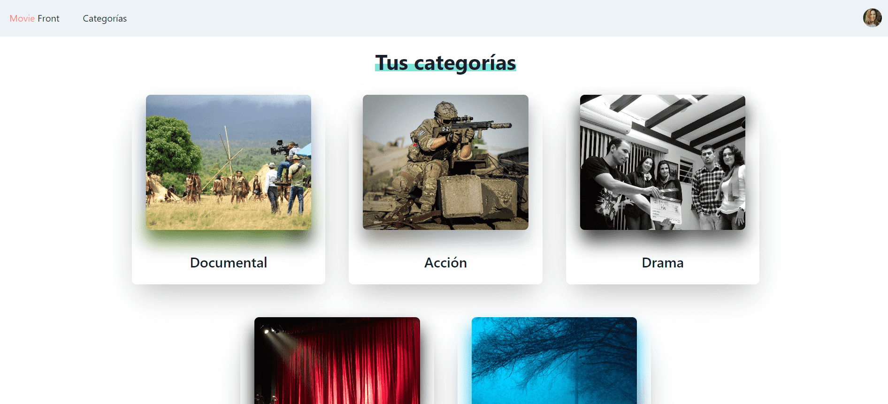

### Visualización del contenido de las categorías.

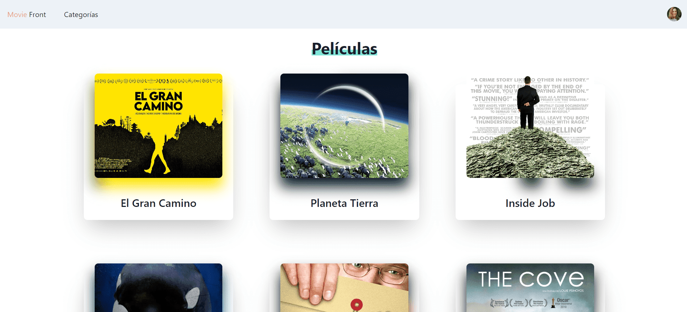

### Visualización del contenido multimedia y su respectiva información.

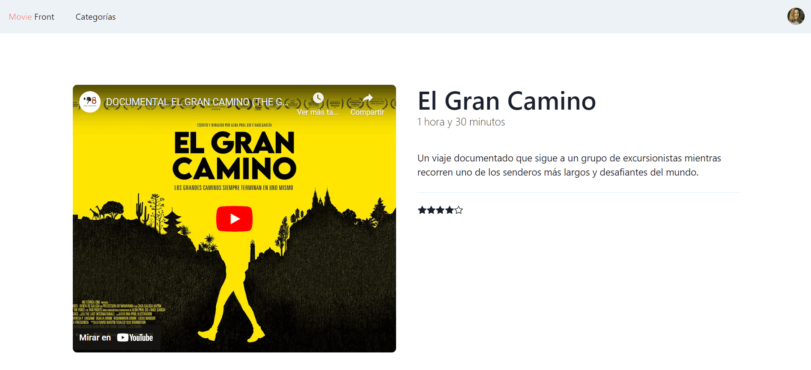

### Página 404 para contenido no encontrado.

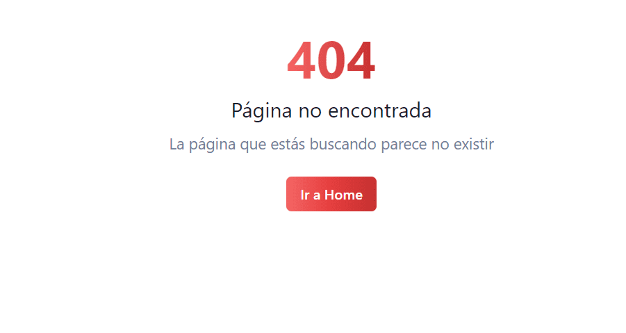

### Diseño responsive.

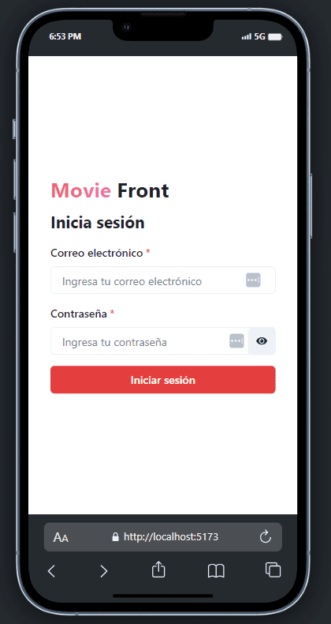
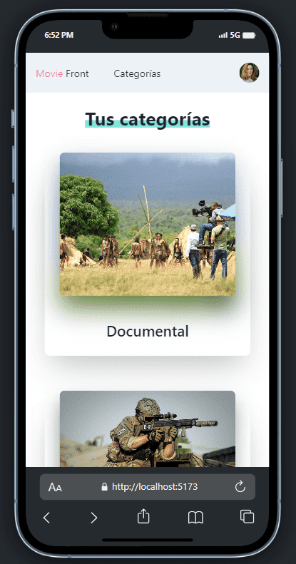
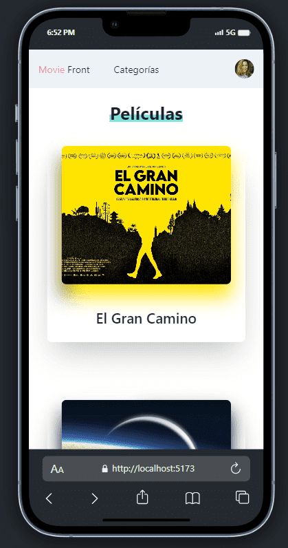
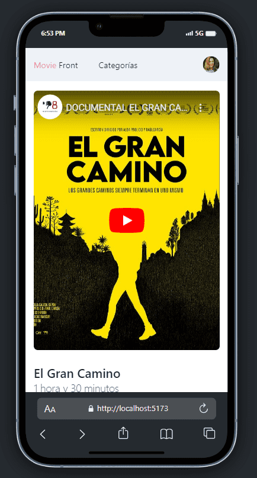

### Tema claro y oscuro.

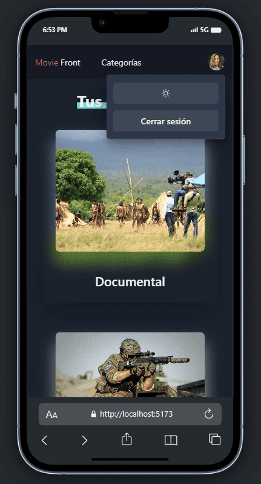
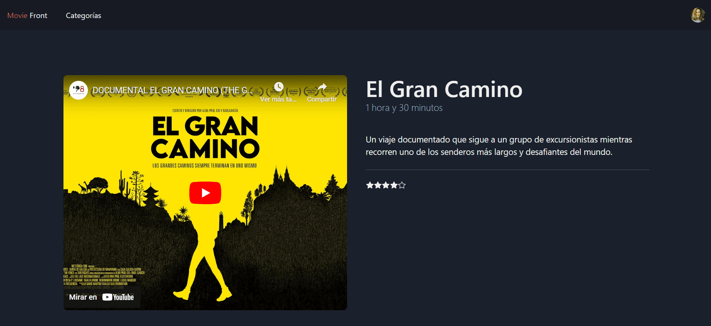
